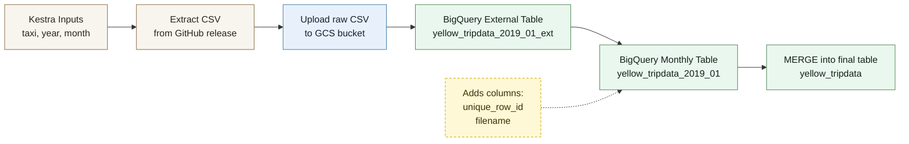
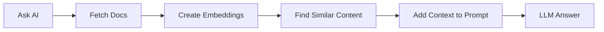

# Module 2 — Workflow Orchestration

## Workflow Orchestration

Coordinating task execution in a data pipeline: defining order, dependencies, scheduling, and failure handling.

**Example:** ingest data from an API → clean it → load it into the warehouse → notify. Without orchestration, you run each step manually. With orchestration, everything happens automatically in the correct order.

## Kestra

An open-source workflow orchestrator. Workflows are defined in YAML and can trigger containers, Python scripts, SQL queries, API calls, and more.

**Difference from other orchestrators:**

| | Kestra | Airflow | Prefect |
|---|---|---|---|
| Definition | YAML | Python | Python |
| UI | full, modern | basic | modern |
| Learning curve | low | high | medium |
| Deployment | simple (Docker) | complex | medium |

Airflow is the most widely used in production, but it requires more knowledge to configure. Kestra is more approachable for beginners.

---

## 2.3.2 - Load Data into Postgres with ETL — Data Engineering Zoomcamp

**Flow:** `flows/04_postgres_taxi.yaml`

This pipeline ingests NYC taxi data into PostgreSQL by downloading the CSV, loading it into a staging table, adding metadata, and merging only new rows into the final table.

1. **set_label** — adds visual labels to the execution, such as taxi type and file name, to make it easier to identify in the Kestra UI
2. **extract** — downloads the compressed CSV (`.gz`) from GitHub, decompresses it, and stores it in Kestra's internal storage
3. **if_yellow_taxi / if_green_taxi** — executes the block corresponding to the selected taxi type; each block contains:
   - create the main table and the staging table if they do not already exist
   - clean the staging table with `TRUNCATE`
   - copy the CSV into staging with `CopyIn`
   - generate `unique_row_id` using an MD5 hash of key fields and register the file name
   - `MERGE` from staging into the main table, inserting only new rows for idempotency
4. **purge_files** — removes temporary execution files

### Why use staging?

The staging table receives the raw CSV data first. Only after that does the `MERGE` move data into the final table, preventing duplicates if the flow is rerun with the same file.

### Staging Table — What It Is and Why It Exists

A **staging table** is a temporary table that serves as an intermediate area between the data source, the CSV, and the main table. Data enters staging first, goes through transformations, and only then moves to the final table.

### Why truncate staging before loading?

`TRUNCATE` completely clears the staging table before each execution. The reason is that the workflow processes **one month at a time**, so staging should contain only the data for that specific execution. Without `TRUNCATE`, data from previous runs, other months, would mix with the new data and corrupt the result.

### Why not insert directly into the main table?

Staging makes it possible to transform the data before the final merge:

1. **Generate `unique_row_id`** — computes an MD5 hash by combining key fields from each row, such as pickup date, location, and fare amount. This creates a unique identifier per trip.
2. **Register the `filename`** — records which file each row came from, which improves traceability and debugging.

Only after these transformations does the `MERGE` compare staging against the main table using `unique_row_id` and insert only the rows that do not already exist, guaranteeing **idempotency**. Running the same flow twice does not duplicate data.

### Incremental Load

The strategy used in this pipeline is **incremental loading**. Instead of deleting and reloading all data on every run, a full load, only new data is inserted into the final table.

This is done by the `MERGE`: it compares each row in staging with the main table using `unique_row_id`. If the row already exists, it is ignored. If it is new, it is inserted.

**Practical example**

For **green, 2019, January**, think of the flow in 3 simple layers:

1. **CSV file**: the pipeline downloads `green_tripdata_2019-01.csv`
2. **Staging table**: the file is loaded into staging, which is cleared on every run
3. **Final table**: `MERGE` inserts only rows that do not already exist

If you run the same month again, the CSV is downloaded again and staging is reused, but the final table does not duplicate rows because the IDs already exist.

If you run **green, 2019, February**, staging is cleared and filled with February data, while the final table keeps January and adds only the new February rows.

---

## 2.3.3 - Scheduling and Backfills — Data Engineering Zoomcamp

**Flow:** `flows/05_postgres_taxi_scheduled.yaml`

### Scheduling

Scheduling means the flow runs automatically at a defined time, without needing manual execution.

### Backfills

Backfills mean running that same scheduled logic for past dates, usually to load historical data or recover missed runs.

---

## 2.4.1 - ETL vs ELT — Data Engineering Zoomcamp

| | ETL | ELT |
|--|-----|-----|
| Order | Extract -> Transform -> Load | Extract -> Load -> Transform |
| Where transformation happens | before loading, local or server | after loading, in the cloud |
| Best for | small volumes, nightly schedules | large volumes, cloud processing |

**Why ELT became stronger with the cloud:** transforming millions of rows locally is slow. Loading first into a Data Lake and transforming later using BigQuery's processing power is much faster and cheaper.

### Data Lake vs Data Warehouse

- **Data Lake** such as Google Cloud Storage stores raw, unstructured data. It is cheap and preserves the original data.
- **Data Warehouse** such as BigQuery reads data from the Data Lake through queries without needing to move everything inside first. You pay for what you query, not for raw storage.

**The core point:** in ELT, the original data remains intact in the Data Lake. Transformations are done on top of it through queries, which makes it easier to reprocess everything from scratch if needed.

Loading into the destination before transforming lets you use the cloud's processing power. What would take a long time on a local machine can be done in a fraction of that time in the cloud.

### What comes next (ETL -> ELT migration)

1. **Extract** — make an HTTP request to download the CSV files from GitHub
2. **Load** — load them directly into Google Cloud Storage, the Data Lake, without transforming them locally
3. **Transform** — use BigQuery to map the GCS data, add metadata, and run the heavy transformations in the cloud

The goal is to eliminate the local processing bottleneck, which is slow for millions of rows, and use Google Cloud scalability instead.

---

## 2.4.2 - Setting up Google Cloud and BigQuery — Data Engineering Zoomcamp

To connect Kestra to Google Cloud in local development, the important idea is simple: keep credentials outside the flow file and expose them to Kestra as a secret.

Non-sensitive values such as project ID, location, bucket name, and dataset name can be stored as reusable KV pairs, while the service account stays in a secret.

The flow [flows/06_gcp_kv.yaml](/home/ygritte/dev/de-zoomcamp-2k26/george-dataengineering-zoomcamp/02-workflow-orchestration/flows/06_gcp_kv.yaml) exists only to create those reusable GCP configuration values inside the `zoomcamp` namespace.

In short:

- use `secret()` for credentials
- use `kv()` for reusable non-sensitive configuration
- avoid hardcoding GCP values directly inside every flow

**Source:** Kestra official guide, "Google Credentials"  
https://kestra.io/docs/how-to-guides/google-credentials

---

## 2.4.3 - Load Data into BigQuery with ELT — Data Engineering Zoomcamp

**Flow:** `flows/08_gcp_taxi.yaml`

This flow moves the taxi pipeline from local Postgres ETL to a cloud-style ELT approach using **Google Cloud Storage** and **BigQuery**.

### Staging in `05` vs `08`

In `05_postgres_taxi_scheduled.yaml`, the staging table is a physical table inside Postgres, such as `public.yellow_tripdata_staging` or `public.green_tripdata_staging`. The flow downloads the CSV, imports the data into that staging table with `CopyIn`, clears the staging table with `TRUNCATE` on each execution, runs an `UPDATE` to generate `unique_row_id` and `filename`, and only then runs `MERGE` into the final table. In other words, the staging table is the local intermediate workspace.

In `08_gcp_taxi.yaml`, that same fixed staging table does not exist. Instead, the intermediate layer is split into two parts in BigQuery:

- an external table, which points to the CSV in GCS without loading the file into a native BigQuery table
- a temporary or monthly table created with `CREATE OR REPLACE TABLE`, already including `unique_row_id` and `filename`

This split exists because BigQuery works very well when it reads files directly from cloud storage and only materializes the part that is actually needed.

### 1. External table

The external table works like a shortcut in BigQuery to a file that lives outside BigQuery, in this case in GCS.

Example:

- real file in the bucket: `gs://meu-bucket/green_tripdata_2019-01.csv`
- external table in BigQuery: `meu_projeto.meu_dataset.green_tripdata_2019_01_ext`

That external table does not store the data inside BigQuery. It only stores the definition of how BigQuery should read the file.

### 2. Temporary or monthly table with `CREATE OR REPLACE TABLE`

After that, the flow creates a real BigQuery table from the external table.

At that point it is no longer just a pointer. The data is materialized into a native BigQuery table, already transformed with fields such as `unique_row_id` and `filename`.

---

## 2.4.4 - Backfills with BigQuery — Data Engineering Zoomcamp

Creates a scheduled version of the BigQuery ELT flow, replacing manual year and month inputs with `trigger.date` so each run automatically processes the correct monthly taxi file and can also be used for backfills.

---

## 2.5.1 to 2.5.3 - Using AI for Data Engineering in Kestra — Data Engineering Zoomcamp

AI can help data engineers reduce boilerplate work, search documentation faster, and draft pipeline structures more quickly. A general LLM can generate a Kestra flow that looks mostly correct, but it may still miss required fields, produce small syntax mistakes, or omit important configuration details. The idea of this section is that AI is useful for acceleration, but the output still needs validation. To improve that experience inside the platform itself, Kestra provides an AI Copilot that helps generate and refine flows in a more guided way.

---

## 2.5.4 - Retrieval Augmented Generation (RAG) — Data Engineering Zoomcamp

To further learn how to provide context to your prompts, this bonus section demonstrates how to use RAG.

### What is RAG?

**RAG (Retrieval Augmented Generation)** is a technique that:

1. **retrieves** relevant information from your data sources;
2. **augments** the AI prompt with this context;
3. **generates** a response grounded in real data.

This solves the hallucination problem by ensuring the AI has access to current, accurate information at query time.

### How RAG Works in Kestra

### The process

1. **Ingest documents**: load documentation, release notes, or other data sources.
2. **Create embeddings**: convert text into vector representations using an LLM.
3. **Store embeddings**: save vectors in Kestra's KV Store or in a vector database.
4. **Query with context**: when you ask a question, retrieve relevant embeddings and include them in the prompt.
5. **Generate response**: the LLM now has real context and can provide more accurate answers.

In short, without RAG the response is based only on the model's internal knowledge. With RAG, the response combines the model's knowledge with context retrieved from a real source.
